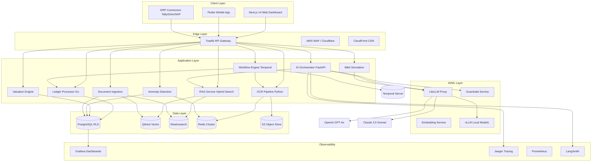

# Architecture Documentation
## AI-Native Accounting Platform — Multi-Phase Evolution

---

## 1. System Architecture Overview



---

## 2. Phase Architecture Evolution

### Phase 1: SME Foundation (Months 1-3)
**Core Hypothesis:** Automate the highest-volume, lowest-margin work (bookkeeping, GST filing, CMA generation) to free up human accountants for advisory.

| Service | Technology | Key Design Decision |
|---------|-----------|---------------------|
| Ledger Processor | Go + PostgreSQL | Decimal precision for INR, partitioned tables for 10M+ rows/client |
| OCR Pipeline | Python + Tesseract | Rule-based extraction first; LLM fallback for unstructured fields |
| RAG Service | FastAPI + Qdrant/ES | Hybrid search (alpha=0.7) with cross-encoder reranking |
| AI Orchestrator | FastAPI + LangGraph | Intent routing with confidence threshold; fallback to human CPA |
| Guardrails | Transformers | Zero-shot classification for topical enforcement |

### Phase 2: Advisory RAG (Months 3-6)
**Core Hypothesis:** Scale advisory revenue by making every client feel they have a Tier-1 tax partner available 24/7.

| Service | Technology | Key Design Decision |
|---------|-----------|---------------------|
| Document Ingestion | Python + Scrapy/BS4 | Nightly cron ingestion of CBIC/MCA/IT portals; semantic chunking with 50-token overlap |
| Valuation Engine | Python + SciPy | Black-Scholes for ESOP; 409A composite (Income/Market/Asset weighted) |
| Workflow Engine | Temporal.io | Saga pattern for Invoice-to-Ledger STP; idempotency keys on all activities |
| Cross-Border Navigator | Next.js | FEMA timeline visualization; DTAA side-by-side translation viewer |

### Phase 3: Enterprise Predictive (Months 6-9)
**Core Hypothesis:** Large corporates will pay premium for predictive insights (anomaly detection, M&A simulation, ESG compliance) that reduce audit risk and optimize tax strategy.

| Service | Technology | Key Design Decision |
|---------|-----------|---------------------|
| Anomaly Detection | Python + scikit-learn | Isolation Forest for multivariate outliers; rule-based for duplicates/round numbers |
| M&A Simulation | Python + LangGraph | Multi-agent (Financial/Legal/Tax/Strategic) with deterministic DCF/LBO models |
| Deep-Audit Console | Next.js + AG Grid | Immutable audit trail viewer; bulk actions with biometric approval gates |
| Enhanced Guardrails | NeMo + Custom | RBAC integration; execution guardrails with HSM-backed approval requirements |

---

## 3. Data Flow Diagrams

### 3.1 Invoice-to-Ledger STP (Phase 2)
```
[Mobile Camera / Web Upload]
    |
[S3 Trigger] -> [OCR Pipeline]
    |
[Document Classification] -> ResNet/ViT
    |
[Data Extraction] -> Tesseract + LLM
    |
[Validation Engine] -> GSTIN/HSN/Amount checks
    |
[Temporal Workflow] -> Saga orchestration
    |
[Ledger Processor] -> Double-entry posting
    |
[Bank Reconciliation] -> Account Aggregator API
    |
[GSTN Integration] -> GSTR-1/3B auto-reconciliation
    |
[Exception Dashboard] -> Human-in-the-Loop (HITL)
```

### 3.2 AI Advisory Query (Phase 2/3)
```
[User Query]
    |
[Guardrails Service] -> Topical + Execution + Hallucination checks
    |
[Router Agent] -> Intent classification (confidence > 0.85)
    |
[Specialized Agent]
    |-- Tax Agent -> RAG retrieval from IT Act/GST Circulars
    |-- FEMA Agent -> DTAA article retrieval + FEMA timeline
    |-- Quant Agent -> Python REPL / Excel generator
    |-- Document Agent -> Contract clause comparison
    |
[Self-Reflection Loop] -> Secondary model validates citations
    |
[Response Generation] -> Citation-mandatory output
    |
[Confidence Badge] -> High/Medium/Low
    |
[Immutable Audit Log] -> Chain-hashed entry
```

---

## 4. Security Architecture

### 4.1 Zero-Trust Network
- mTLS between all microservices (SPIFFE/SPIRE in production)
- VPC peering for database access; no public PostgreSQL endpoints
- AWS PrivateLink for S3 and Elasticsearch access

### 4.2 Data Protection
| Data Class | Protection | Key Rotation |
|-----------|-----------|-------------|
| PAN/Aadhaar | Format-Preserving Encryption (FPE) | 90 days |
| Bank Accounts | AES-256-GCM + envelope encryption | 90 days |
| LLM Context | PII tokenization before embedding | Per-request |
| Audit Logs | SHA-256 chain hashing | Immutable |

### 4.3 AI Guardrails Layers
1. **Topical:** Zero-shot classification blocks non-accounting queries
2. **Hallucination:** Self-reflection loop + mandatory citation requirement
3. **Execution:** Pattern matching + RBAC prevents autonomous financial actions
4. **NeMo Rails:** Conversational guardrails for off-topic drift

---

## 5. Scaling Strategy

### 5.1 Horizontal Scaling
- **Ledger Processor:** Stateless Go service; HPA at 70% CPU
- **RAG Service:** Embedding cache in Redis; Qdrant sharding at 10M vectors
- **AI Orchestrator:** LiteLLM proxy handles model routing; vLLM for PII workloads

### 5.2 Peak Season Handling (KEDA)
```yaml
# KEDA ScaledObject for tax season
apiVersion: keda.sh/v1alpha1
kind: ScaledObject
metadata:
  name: ledger-processor-scaler
spec:
  scaleTargetRef:
    name: ledger-processor
  triggers:
  - type: cron
    metadata:
      timezone: Asia/Kolkata
      start: 0 0 1 7 *   # July 1 - ITR season
      end: 0 0 31 7 *
      desiredReplicas: "20"
  - type: cron
    metadata:
      timezone: Asia/Kolkata
      start: 0 0 10 * *  # 10th of every month - GST deadline
      end: 0 0 15 * *
      desiredReplicas: "15"
```

---

*Document Version: 3.0*
*Last Updated: 2026-06-07*
